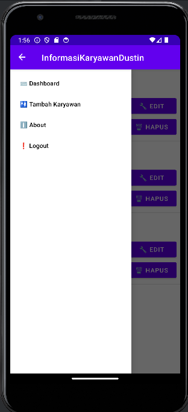

Kalian sedang membaca konteks dan tujuan dari aplikasi ini, aplikasi informasikaryawan ini adalah aplikasi sederhana yang telah dibuat oleh Dustin Naldo Lysandry dari sekolah tinggi STMIK WIDYA CIPTA DHARMA. Aplikasi ini bertujuan untuk menampung data gaji karyawan dan sekaligus membuat atau mendaftarkan akun karyawan tersebut. pada halaman utama terdapat hamburger button yang menampilkan beberapa tombol
yang bisa di klik, terdapat tombol dashbaord yang bertujuan untuk memperlihatkan data-data dalam database, tombol tambah karyawan untuk menambahkan data karyawan baru,
tombol informasi yang menyediakan halaman konteks dalam kegunaan aplikasi informasi karyawan tersebut dan tombol logout untuk mengeluarkan pengguna yang sudah selesai menggunakan aplikasi tersebut.
